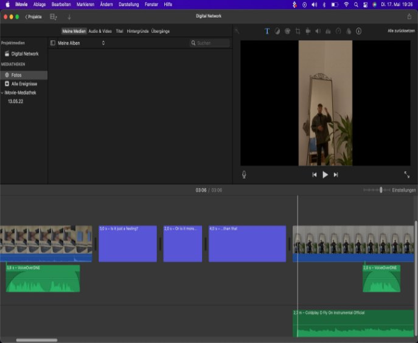



**CBS   INTERNATIONAL BUSINESS SCHOOL** 

**Schiefer – More than a Bag** 

Coursework Paper in “Digital Network Economy” Summer Semester 2022 

Lecturer: Ulrich Anders 

Felix Dickler 

MA 23 Entrepreneurship Student-No. 1215800152 

1. **What  is  the  context?**  

The  product  video  is  about  promoting  a  bag  for  men  by  the  brand *Schiefer*. *Schiefer* is  a 

startup  company  of  friends  of  mine  that  hasn`t  released  any  commercials  for  the  product yet.  Because  of  that,  I  could  build  a  brand  image  from  scratch  totally  unbiased.  

In  the  progress  of  running  through  ideas  regarding  how  the  product  should  be advertised  I  came  up  with  three  main  approaches.  

1. **Identity  Approach** 

A  persons  identity  is  what  makes  a  person.  Finding  your  true  identity  is  what  most people  are  looking  for  their  whole  life.  Therefore,  the  way  you  dress  says  a  lot  about your  personal  core  values,  beliefs  or  attitudes.  All  those  attributes  are  a  part  of  a 

persons  identity.  I  want  to  sell  the  bag  as  that  it  is  or,  to  be  fair,  can  be  the  missing part  to  find  ones  true  identity.  

2. **General  Approach**  

A  bag  can  make  a  difference  regarding  a  persons outfit.  But  there  are  so  many  bags 

sold  by  different  labels  that  it  can  be  hard  to  point  out  why  a  particular  bag  is  special. The  bag  from *Schiefer* focuses  more  on  the  design  than  on  practical  abilities,  meaning 

there  are  no  special  functions  that  other  bags  usually  dont  have.  Therefore,  I  wanted 

to  focus  more  on  fashionable  aspect  in  the  product  video.  I  chose  a  fully  black  outfit 

for  my  model  in  the  video  to  highlight  the  grey  bag.  Still,  I  tried  to  not  put  the  focus too  much  on  the  bag  to  keep  a  little mystery  and  therefore  keep  the  viewer  curious 

what  the  video  is  really  about  until  the  end.  I  think  the  mistery  aspect  is  a  very important  one  when  creating  a product video  of  a  3  minute  length  in  order  to  keep 

the  viewer  interested.  

3. **Social  Approach**  

In the  past,  fashionable  bags  for  heterosexuell  men  have  not  always  been  accepted 

by  society.  Therefore,  the  product  video  emphasizes  on  making  progress  and  tries  to convince  the  viewer  that  this  way  of  thinking  is  outdated.  

All  three  approaches  combined  intend  to  provide  the  watcher  with  a  certain  feeling  from which  it  is  difficult  to  tear  oneself  away.  

2. **Why  should  the  video  be  interesting  to  watchers?**  

In  my  opinion,  I  think  it  is  hard  to  keep  a  particular  watcher  attentive  for  a  total  of  3 minutes.  Because  of  that,  my  main  approach  towards  keeping  the  video  interesting  was 

to  keep  a  little  mistery  regarding  what  the  video  is  about.  Therefore,  the  bag  was  only 

part  of  the  visuals  while  the  focus  was  also  on  the  model  and  his  environment.  I  tried  to document  a  typical  day  in  the  life  a  regular  young  person  to  make  the  video  and 

therefore  the  bag  interesting  for  a  wide  range  of  people.  I  put  in  the  music  and  the  text (Voice  over)  that  I  wrote  for  the  video  to  arouse  the  watchers  emotions.  I  filmed  the 

video with  my  Iphone  in  order  to  attract  especially  younger  people  (18 – 40)  and  to  keep 

up  with  the  digital  age.  Additional  features  that  were  put  into  the  video  like  e.g.  posting  a picture  of  the  model  on  Instagram  and  liking  the  post  afterwards  should  help  the 

watchers  to  relate  to  the  video.  Furthermore,  the  filter  I  used  for  the  visuals  is  also  very popular  on  social  media  platforms  and  should  make  the  video  more  attractive  for  young watchers.  The  video  starts  with  the  model  finishing  his  work  to  go  out  and enjoy  his  free 

time.  I  choose  that  concept,  because  I  feel  like  free  time  is  more  fun  for  people  to  see  and more  effecient  in  order  to  touch  peoples  emotions.  

All  those  aspects  should  make  the  video  very  relatable  for  the  target  group  (men  from 

18 – 40) and  therefore  interesting  to  watchers.  

3. **What  considerations  were  put  into  the  video?**  

Apart  from  the  considerations  that  were  already  mentioned  by  explaining  the  content and  why  the  video  should  be  interesting  for  watchers  there  are  even  some  more  worth mentioning.  To  name  one,  I  wanted  to  emphasize  that  diversity  matters,  which  is  why  I chose  a  model  that  is  half  indian  and  half  german.  Furthermore,  the  video  has  a  lot  of cuts  and  changes  of  speed  in  order  to  make it  more  dynamic  and  appealing.  Therefore,  I 

also  tried  to  use  different  angles. I  put  in  recordings  of  beautiful  buildings  and  blue  Skies 

to  stress  out  the  „feeling-­‐good-­‐purpose“ of  the  video.  I  decided  to  set  the  focus  on  the 

bag  in  the  beginning,  in  the  middle,  and  at  the  end  of  the  video,  each  time  making  it 

stand  out  a  little  bit  more, in  order to  create  a  recurring  theme  through  the  video  and to increase  the  suspense.  

4. **What  story  telling  scheme  did  you  use?** 

I  documented  a  whole  day  of  a  person  to  make  the  video  more  varied  and  tell  a  story 

that is easy  to  follow.  The  model  is  riding  his  bicycle,  going  out  for  drinks  and  food  with friends  to  represent  a  normal-­‐day-­‐life  and  make  it  relatable  for  the  watchers. While  the 

music  that  is  played  through  the  video  plays  a  supporting  role  to  sell my story,  the  voice-­‐

over  and  text  that  is  used  is  essential  to  get  the  real  purpose  across.  It  was  important  for me  that  the  text  in  general  relates  to  life  changing  attributes,  that  are  all  important  to 

find  ones  identity like  purpose,  inspiration,  goals, change  and  more. I  put  in  the  words 

„is  it  just  ...“  and  „or  is  it  more  than  that?“ several  times to  finally  come  to  the  conclusion 

that at  the  end  it  is in  fact  all  related  to  the  slogan  that  appears  at  the  very  end  of  the video  saying  „More  than  a  bag“. The *Schiefer* bag  is  more  than  a  bag  because  it 

represents *progress*.  Finding  your  true  identity,  and  all  the  attributes  that  were already 

mentioned and  that are  a  part  of  ones  identity,  stand  for *progress*.  Overcoming  social 

barriers  like  wearing  a fashionable  bag  as  a  man stands  for *progress,* which  is 

emphasized by  the  quote  from  the  voiceover:  „Rules  are  there  to  be  rewritten  and  norms are  there  to  be  set“. Even  the  fact  that  the  model  is  riding  his  bicycle  instead  of  driving  a car  represents  progress  in  terms of sustainable  energy matters. In my  perception, all 

people,  and  especially  younger  people,  want  to  make *progress* in  their  life.  Therefore, 

*progress* is  the  secret  ingredient  to  my  story  which  is  only  revealed  at  the  end  of the story-­‐telling-­‐voiceover.  I  chose  to  show  the  bag  alone  for  the  very  first  time  right  after that  to  provide the  watcher  with  more  transparency  and  to  make  it  fully  clear  that  the bag  is  actually  the  center  point  of  everything.  

When  I  wrote  the  text  for  my  video  I  tried  to keep  ro m  for  interpretation.  Therefore,  it 

is  irrelevant  if  a  particular  watcher  has  a  different interpretation of  what  is tried to  be communicated  in  the  story  of  the  the  product  video. In  fact, the  story  is  not  written  to show  transparently  how  the  content  is  connected  to  the  bag  itself or  how  the  watcher  is supposed  to  interpret  it,  since ev ry  person  has  his  or  her individual perception.   

It  is  written  to  keep  a  little  mistery and  therefore, to  make  the  watcher  make  up  his  own mind  regarding  what  he just  experienced  and  what  connections he can  find.  

In  the  end,  the  only  thing  that  matters  is  that the  watcher gets  emotionally  attached  in  a 

positive  way  to  make  the  bag  the  missing  peace  to  his  outfits  or  maybe  even  to  his  life.  

5. **Reflection  and  experience**  

I  had  a  great  time  creating  this  project,  because  I  like  to  get  creative.  Once  I  had  the  idea everything  about  what  is  going  to  happen  in  the  product  video  felt  very  natural.  It  was 

the  first  time  I  produced  a  video  and  I  very  much  enjoyed  it.  I  actually  finished  it  at  night 

since  I  forget  the  time  because  I  kept  my  concentration  high.  To  see  what  is  possible 

with  only  visuals  produced  by  an  Iphones  is  a  big  realization  to  me  and  I  am  actually looking  forward  to  something  similar  again.  Since  I  make music  for  several  years  now  I 

guess  I  may  have  found  an  additional  way  to  express  myself  now.  

6. **Resources**  

-­‐ Iphone  12  

-­‐ Imovie  

-­‐ Music:  Coldplay – O „Fly  On“ (Instrumental)  

-­‐ Photo-­‐clicking-­‐sound  downloaded  from  youtube  -­‐ MOTIV  audio  app  used  for  Voiceover  

7. **Screenshot**

**Affirmation** 

` `I  hereby  affirm  that  I  have  written  this  academic paper independently  and  without  the help  of  others. In  doing  so,  I  have  used  only  the  sources  and  means  mentioned. I  have not  used  works  or  parts  of texts  that  are  protected  by  copyright without changing  or having  reworked  them. Passages  in  the paper where  the  wording  or  meaning  is  taken from  other  works  or  sources  –  including  those  taken  from  the  internet –  have  been identified  as  quotations,  citing  the  exact  source.** 

**Granting of  Rights  of  Use** 

To  check  the paper for  violations  of  copyright  and  plagiarism,  CBS  uses, in  addition  to 

the  manual  examination,  a  so-­‐called  web-­‐based anti-­‐plagiarism  software.  To  carry  out 

this  examination  of  the paper,  I  grant  CBS  and  their  external  service  providers  the  right to  reproduce  the  paper  electronically,  to  save  and  temporarily  store  it,  as  well  as  to consult  it  for  an  indefinite  period  for  comparative  purposes  when  checking  other papers. I  therefore  give  my  consent  for  my paper to  be  stored  and  used  for  a  plagiarism assessment  and to  be  passed  on  to  a  provider  of  a  web-­‐b sed  plagiarism  software  here 

or  abroad,  which  may  only  process  and  use  the  paper  for  this  purpose.   

**Data  Privacy  Declaration** 

An  examination  paper can  also  contain  statements  about  the  personal  and  factual circumstances  of  the  student or other  persons concerned. The  collection,  storage  and 

use  of  such  data  is  only  possible  with  the  consent  of  the  person  concerned.  In  this context,  I  assure  that  all persons  concerned  (e.g.  interview  partners,  if given)  have 

consented  to  a  publication  and  that  I  have  clarified  whether  anonymisation  is  desired and  that  all  personal  data  have  been  anonymised  for  those  persons  who  have  consented to  publication  only  in  anonymous  form. 

Cologne, *13.05.22* 

*Felix, Dickler, IB  Entrepreneurship*   
6 
